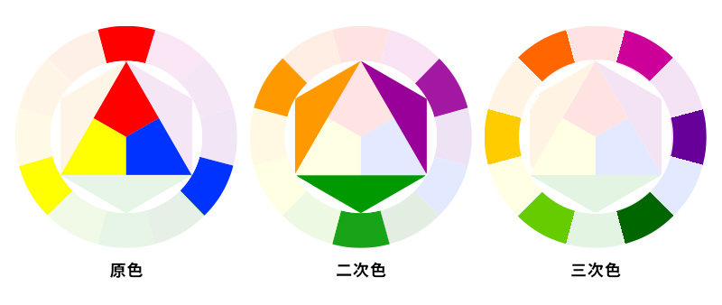
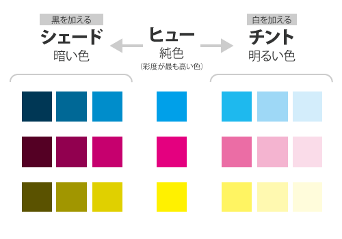

## 全体を通した主張
問題の名前が言えれば、意識できる。解決策が見つけられるようになる。

## 4つの原則
  - 近接(Proximity)
  - 整列(Alignment)
  - 反復(Repetition)
  - コントラスト(Contrast)

<figure>
  
  <figcaption>近・整・反・コ = 金星ハンコ</figcaption>
</figure>

## 原則の使い方
4つの原則を臆病にならず、一層意識して使うこと。臆病になるな。
1. 「原則」に注意を向ける
2. 「原則」を利用していない時、そのことに気づく
3. 「原則」を適用する

## 原則１: 近接
### 定義
- 関連する項目をグループ化する（組織化する）
- 関連しない項目をグループ化しない（組織化しない）
### 効果
- コンテンツ（ページ、空白）が組織化される
- 読まなくても情報が得られる
- どこから読み始めるか明確になる
### 適用方法
1. 情報の論理的構成を整理する
2. 整理した内容を踏まえて関連する項目をグループ化してユニットにする
  - 「関連する項目」 = 情報のやり取りがあるもの
3. ユニット間に適切なスペースを入れる
  - 「スペース」 = 物理的に距離を取る、視覚的に関連させない
  - 今まで自然に行ってきた「近接」を**意識的**にやりましょう、**徹底**させましょう
### ポイント
- まずは「近接」から、これがないと他の原則は意味をなさない
  - 4原則は1つずつ適用する
- 目を細めて、視線が止まった回数を数え、適切か評価する
  - 曖昧なユニットの境界がページ上に存在する場合、近接すべきでない要素が近接していないか確認する
- ユニットの作りすぎ注意

## 原則2: 整列
### 定義
- ページ上のすべての項目を他の項目と視覚的に関連させる
### 効果
- **一体性**が出る
- 情報がより組織的になる（近接の原則で分離したユニットを結びつける）
- レイアウトに力強さを与える
### 適用方法
- ベースライン（線）を揃える
- 基本、文字揃えは1ページ1種類（右揃え、左揃え、中央揃え、均等揃え）
  - 慣れるまでは中央揃えは控えた方が良さそう
  - たまに複数の揃えを使う場合であっても、必ず何らかの方法でそれらを整列させる
### ポイント
- ページ上の**すべてのものを意識的に配置**しなければならない
  - ページ上のどんなものであっても、根拠なく配置してはいけない
  - どの項目も他の項目と視覚的に整列するよう気をつける
  - 力強い線をどれか一つ見つけて、それにこだわリましょう
  - 水平にも垂直にも線を引いてみる
  - 整列な微妙な調整が、プロらしい表現への失われたカギであることはよくある
- 中央揃えはフォーマル、静か、普通といった印象で、少し弱く見えることがある
  - 明確に意図的な場合にのみ効果が出る技法
- ルールを破るためのルール
  - ルールを破るためには、まずルールを知らなければならない
  - 知った上で意識的に崩す、大胆に徹底的に崩す（徹底的にやらないならやめておくべき）

## 原則3: 反復
### 定義
- デザイン上の何かの特徴(フォント、罫線、ビュレット、デザイン要素、色、フォーマット、配置・・・)を作品を通して繰り返す
### 効果
- **一貫性**
  - 断片をまとめて一体性を与える
- 情報の組織化
### 適用方法
- プロジェクトにすでに組み込んでいる反復を取り上げて、それをもっと意識的に変更してみる
- 反復のためだけの全く新しい要素を加えてみる
### ポイント
- うるさく、脅迫的に感じるほどには反復させないように

## 原則4: コントラスト
### 定義
- 読者の目をページに引き込むために、作品のさまざまな要素にコントラストをつける
### 効果
- ページに視覚的な面白さを作り出す
- 異なる要素の間に組織的な階層構造や論理の流れを作り出す
### 適用方法
- 書体、線の太さ、色、形、サイズ、空間などでコントラストをつける
### ポイント
- **二つの項目が異なるなら、視覚的に明らかに異ならせる**こと
- 本当には異なっていない場合、「コントラスト」ではなく「衝突」が生まれる
  - 12pxと14pxのフォント、濃い茶色と黒の線の間にはコントラストは生まれない=衝突

## カラー
### カラーホイール
<figure>
  
  <figcaption>3原色・2次色・3次色</figcaption>
</figure>

[参考：色と配色、色の持つイメージ](https://img-flow.com/blog/design/design1/design-color2/)

- 3原色
  - 合成して作ることができない色
- 2次色
  - 3原色のうち2つの色を等量ずつ混ぜ合わせた色
- 3次色
  - 3原色や2次色を等量ずつ組み合わせた色

### 色の関係
- 補色：カラーホイールで真向かいの位置にある色同士
  - どちらか一方をメインカラー、にしてもう一方をアクセントにすると良い
- 類似色：ホイール上で隣り合う色
  - 調和の取れた組み合わせができる
  - チントやシェードを使って組み合わせるのも良い

### チントとシェード
<figure>
  
  <figcaption>ヒュー・チント・シェード</figcaption>
</figure>

[参考：ヒュー・チント・シェード](https://designtext.net/color)

- ヒュー（色相）：純粋な色
- シェード：ヒューに黒を加えた色
- チント：ヒューに白を加えた色
- 単色的な組み合わせ：一つのヒューに対応する複数のチントやシェードを組み合わせたもの
- チントとシェードの組み合わせ
  - 上記の色の関係を選んで、チントやシェードを使うと幅が広がる

### トーン
- トーン：ある色のヒューの濃淡の特定の質（色合い）
  - トーンが類似しているとコントラストが弱くなる

### 暖色対寒色
- 暖色：赤、黄色を含む色
  - 前面に出る（使いすぎるとうるさくなる）
- 寒色：青を含む色
  - 背景に引っ込む（多量に使うことができる）
- 色に等しい重みを持たせようとしないことが大切
