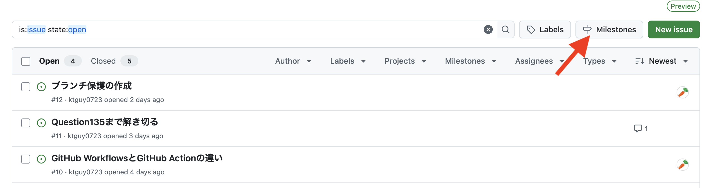
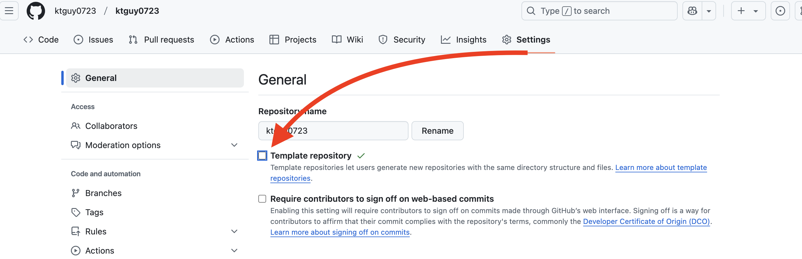
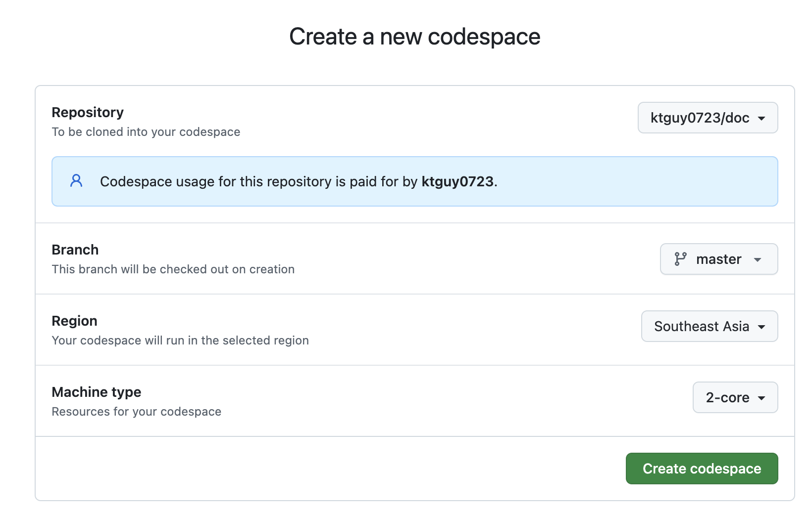
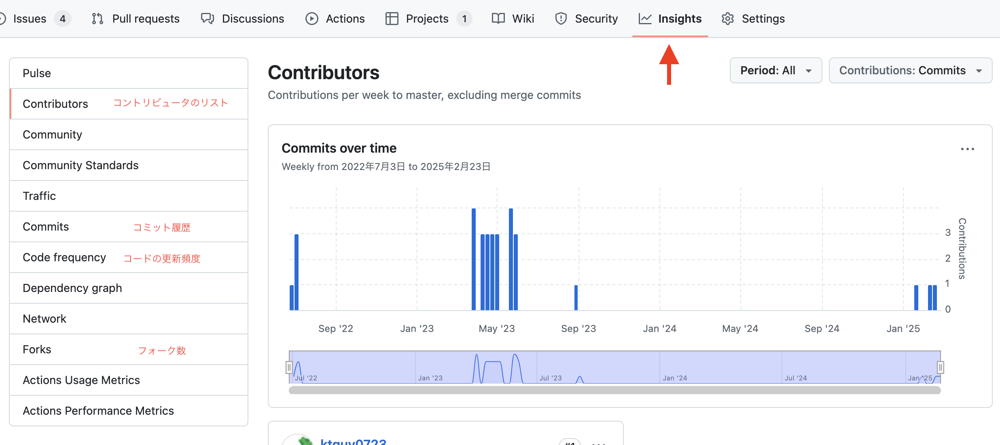

## GitHub Foundations Exam passed with a grade of 80%


## 問題1 
- [x] GitHubアカウントの種類（3種類）
### 解説
- Personal accounts(個人アカウント)
  - 個人が使用するアカウント
  - 無料プランや有料プランがあり、プライベートリポジトリやチーム向けの機能も利用可能
  - 
- Organization accounts(組織アカウント)
  - チームや企業が共同作業をするためのアカウント
  - メンバー管理やリポジトリの権限設定など、チーム向けの機能が充実
  - 無料プラン、有料プランがある
  - 
  - https://genesis-tech.jp/blog/create-github-organization/
- Enterprise accounts(エンタープライズアカウント)
  - 大規模な企業向けのアカウント
  - GitHub Enterprise Cloud や GitHub Enterprise Server を利用できる

## 問題2
- [x] GitHub のイシューやプルリクエストと統合し、作業の計画や追跡を効果的に行うための 柔軟なスプレッドシート、タスクボード、ロードマップ の機能を提供するものは？
### 解説
- GitHub Project
  - 従来の Projects (Classic) から進化し、より柔軟にタスク管理ができる
  - 企業や個人がIssueやPullRequestと連携してプロジェクト管理を行うのに最適なツールです
  - 

## 問題3
- [x] GitHubプロジェクト、イシュー、プルリクエスト間の同期はどのように機能しますか?
### 解説
- IssueやPull Requestの更新はGitHub Projectsに自動的に反映され、逆方向の同期も行われる。

## 問題4
- [ ] GitHubプロジェクトの「カスタムフィールドの追加」の際に見られる特徴は?
### 解説
- カスタムフィールドを使用すると、ターゲット日付やイテレーションフィールドなど、**組み込みオプション以外のメタデータ**を追加できます
  - GitHub Projects では、カスタムフィールドを使用して独自のメタデータ（例：ターゲット日、数値、ステータス、ラベルなど）を追加 できる
  - プロジェクト管理をより柔軟にカスタマイズし、組織のワークフローに適したトラッキングが可能 になる
  - 単なる見た目の変更ではなく、**実際にデータとして利用可能な情報を追加できる**ため、より詳細な管理が可能

## 問題5
- [x] GitHubプロジェクトボードにイシューやプルリクエストを追加する方法は何がある？
### 解説
- **個別追加**・・・必要な Issue や Pull Request を手動で選択し、プロジェクトに追加
- **一括追加**・・・複数の Issue や Pull Request を 一括選択して追加
- **自動追加**・・・プロジェクトワークフロー を設定すると、特定の条件を満たす Issue や Pull Request を自動でプロジェクトに追加

## 問題6
- [x] GitHub Projectで使用できるレイアウトはどれですか?
### 解説
- **Table layout**
  - 
- **Board layout**
  - 
- **Roadmap layout**
  - 

## 問題7
- [x] どのGitHub Projectレイアウトがカンバンボードとして最適ですか?
### 解説
- **Board layout**

## 問題8
- [ ] GitHub Projectに組み込まれているステータスの自動化は何か?
### 解説
- Project内の**イシューまたはプルリクエストがクローズ**→ステータス完了
- Project内の**プルリクエストがマージ**→ステータス完了
- 

## 問題9
- [x] GitHubプロジェクトでの操作を自動化できる手法は何ですか?
### 解説
- **Project workflows**
  - GitHub Projects の組み込み機能で、特定の条件を満たしたときに自動でアクションを実行
- **GitHub Actions**
  - GitHub の CI/CD 自動化ツールを使って、プロジェクトのワークフローをさらに拡張できる
  - `.github/workflows/xxxx.yml`に実行ファイルを格納
  - 

- **GitHub GraphQL API (API連携)**
  - API を使ってプログラムでプロジェクトを操作できる

## 問題10
- [ ] GitHubプロジェクトとGitHubプロジェクトクラシックの違いは?
### 解説
- **GitHub Projectsは、**新しいGitHubのプロジェクト管理機能であり、従来の GitHub Projects classic に比べて**多くの新機能や改善が提供**されている
  - GitHub Projectsは、より柔軟なカスタマイズが可能な 「ボード + データベース」のようなシステムを採用しており、**カラム（列）に自由なフィールドを追加**できるなどの強化がなされている
  - 一方、GitHub Projects classic は、従来のカンバンスタイルのプロジェクト管理機能で、「マイルストーン」「カードの移動」「ラベル管理」 などの基本機能を持つが、新しい GitHub Projects に比べると柔軟性が低い

## 問題11
- [x] ラベルの使用例は何ですか?
### 解説
- **イシュー、プルリクエスト、ディスカッションの分類**
- 

## 問題12
- [ ] リポジトリ所有者がマイルストーンを使用する理由は?
### 解説
- **課題（Issue）やプルリクエスト（Pull Request）を特定のプロジェクトフェーズと関連付ける**ため
  - マイルストーン（Milestone）は、特定の目標やフェーズに関連する Issue や Pull Request をまとめる機能であり、進捗管理に役立つ
- プロジェクトフェーズを完了するために、**残りの作業量を把握する**ため
  - マイルストーンには、進行中の Issue や Pull Request の数、完了率などが表示されるため、チームが進捗を確認しやすくなる



## 問題13
- [x] イシューまたはプルリクエストに人を割り当てるにはどうすればよいですか?
### 解説
- サイドバーの担当者フィールドを使用する
- 

## 問題14
- [x] イシューまたはプルリクエストに同じコメントセットを頻繁に書き込む場合、時間を節約するために何のGitHub機能を使用しますか?
### 解説
- **返信テンプレート**
- users > settingsから作成できる
- 

## 問題15
- [ ] 「保存された返信」はどこで作成され、どこで利用できるか?
### 解説
- 保存された返信は、**GitHub アカウント設定の [保存された返信] セクション**で作成、編集、削除できる
- 保存された返信は、**イシューやプルリクエスト**で再利用できる

## 問題16
- [x] テンプレートリポジトリに関して実行できるアクションにはどのようなものがありますか?
### 解説
- テンプレートリポジトリから**新しいリポジトリを作成**する
- 既存のリポジトリから**リポジトリテンプレートを作成**する
- 

## 問題17
- [x] GitHubプロジェクトのどの機能を使用すると、プロジェクトの現在のステータスと履歴の進行状況を視覚化するためのグラフとチャートを簡単に生成できますか?
### 解説
- **Project Insights**
  - Project Insightsは、GitHub Projects 内でプロジェクトの進捗やタスクの状態を可視化するための機能
  - グラフやチャートを自動生成し、現在の状態や過去の履歴を簡単に確認できる
  - 

## 問題18
- [x] GitHubの継続的インテグレーションおよび継続的デリバリー (CI/CD) プラットフォームの名前は何ですか?
### 解説
- GitHub Actions
  - `/.github/workflows/`に`.yml`ファイルとしてワークフローの設定ファイルが格納される

## 問題19
- [x] GitHub Actionsの一般的な使用例は何か?
### 解説
- プルリクエストをマージする前に自動テストを実行する

## 問題20
- [ ] GitHub Action ワークフローはイベントによってトリガーされます。GitHub Actions がサポートする主要なイベントは何か?(2つ)
### 解説
- **プルリクエスト（Pull Request）がOpenしたとき(作成、変更、マージ)**
  - pull_request イベントは、GitHub Actions のワークフローをトリガーする代表的なイベントの一つ
  - PR の作成、更新、マージなどのタイミングでワークフローを実行できる
- **ブランチにコミットがプッシュされたとき**
  - push イベントは、特定のブランチにコミットがプッシュされたときにトリガーされる
  - 例えば、CI/CD の実行やテストの自動実行などに活用される
- https://docs.github.com/en/actions/using-workflows/events-that-trigger-workflows#about-events-that-trigger-workflows

## 問題21
- [ ] 一般公開されている GitHub Actions はどこにありますか?
### 解説
- **GitHub Marketplace**
  - 左上のアイコン > Marcketplaceからアクセスできる
  - 

## 問題22
- [x] 次のツールのうち、コード入力時にオートコンプリートスタイルの提案を提供するAIペアプログラマーとして機能するものはどれですか?
### 解説
- **GitHub Copilot**
  - VSCodeで使用する場合は`GitHub Copilot`拡張機能をインストールする
  - 
  - 利用状況や利用プランはsettingsから確認可能
  - 

## 問題23
- [x] GitHub Copilotは無料で使用できますか?
### 解説
- **認証済みの学生、教師、または人気のあるオープンソースプロジェクトのメンテナーであれば無料**
- 無料プランは、1か月あたり 2,000 回のコード補完と 50 件のチャットメッセージに制限

## 問題24
- [x] GitHub Copilot IndividualとGitHub Copilot Businessの違いは何ですか?
### 解説
- GitHub Copilot Individual:
  - **個人アカウント向けのプラン**
  - 個人ユーザーが VS Code や JetBrains などで AI 補完を利用可能
  - 価格: $10/月（または $100/年）（学生・教育者・OSSメンテナーは無料）
- GitHub Copilot Business:
  - **企業や組織向けのプラン**
  - 組織内のメンバーが Copilot を利用できるようにライセンス管理可能
  - 価格: $19/ユーザー/月
  - データの取り扱いが異なり、**企業のコードを学習データとして利用しない**（セキュリティ面での配慮）

## 問題25
- [x] GitHub Copilotサブスクリプションをアクティブ化した後、どのようにしてGitHub Copilotの使用を開始できますか?
### 解説
- **Visual Studio CodeやJetBrainsなどのサポートされているIDEのいずれかでGitHub Copilotをセットアップし、コーディングを開始**

## 問題26
- [ ] GitHub Codespaceとは何ですか?
### 解説
- **リポジトリ専用に設定された事前構成済みの開発環境**
- ローカル開発環境を設定しなくても、プロジェクトのコードをすぐに書き始めることができる
- 

## 問題27
- [x] リポジトリへの貢献に必要なすべてのツールと依存関係がインストールされた、事前構成された開発環境を作成できる GitHubの機能はどれですか?
### 解説
- **GitHub Codespaces**
  - 開発者がすぐにコーディングを開始できる「事前構成された開発環境」を提供する機能

## 問題28
- [x] リポジトリ貢献者が Web ブラウザーから直接簡単なコード変更を行える GitHub の機能はなんですか?
### 解説
- **GitHub Codespaces**
  - クラウドベースの VS Code 環境で、より高度なコード編集が可能
  - リポジトリごとに事前構成された開発環境をセットアップでき、依存関係もインストールされた状態で作業できる
  - github.dev よりも強力で、フル機能の IDE 環境を提供
  - ブラウザまたはローカルの VS Code からアクセス可能
- **github.dev editor**
  - GitHub の Web エディタ（github.dev）を使えば、ブラウザ上でコードを簡単に編集可能
  - リポジトリのコードを編集する際に `.`（ドット）キーを押すだけで、github.dev エディタが開く
  - 軽量な VS Code の Web 版のような UI で、簡単な修正ができる
  - ローカル開発環境のセットアップ不要

## 問題29
- [x] GitHub Codespace のライフサイクルフェーズにはどのようなものがありますか?
### 解説
- **Create, Rebuild, Stop, Delete**
- 
- https://dev.to/learnwithsrini/code-with-github-codespaces-4hbh

## 問題30
- [x] GitHub Codespace環境を停止した場合、コミットしていない変更を後で元に戻すことができますか?
### 解説
- はい、これはGitHub Codespaceを停止してから起動するときのデフォルトの動作
  - GitHub Codespaces では、環境を停止しても未コミットの変更は保持される
  - 停止した Codespace を再開すれば、作業内容はそのまま復元される
  - クラウド上に環境が保存されるため、ローカル PC をシャットダウンしても作業を継続できる
  - ただし、一定期間経過すると Codespace が削除される可能性があるので、重要な変更は適切にコミットしておくのがベスト

## 問題31
- [x] GitHub Codespaces ライフサイクルに関する以下の質問に答えよ
  - 停止・再開した場合、プロジェクトの変更はどうなるか？
  - ライフサイクルはいつ始まり、いつ終了するか？
  - ネットワークやブラウザを閉じると、Codespaceはどうなるか？
### 解説
- Codespace を**停止・再開しても、プロジェクトへの変更は失われない**
  - GitHub Codespaces では、作業ファイルがコンテナ内に保存されるため、Codespace を停止しても変更は維持される
- Codespace のライフサイクルは、**作成時に始まり、削除時に終了**する
  - Codespace は 作成 → 使用 → 停止・再開 → 削除 という流れで管理される。削除しない限り、作業内容は維持される
- アクティブな Codespace に**接続を解除・再接続しても、実行中のプロセスには影響しない**
  - ネットワークの切断やブラウザの閉じても、Codespace はバックグラウンドで動作し続けるため、プロセスは中断されない

## 問題32
- [x] GitHub Codespace環境に割り当てられる CPUコアの量をカスタマイズできますか?
### 解説
- はい、コードスペースを作成するとき、またはコードスペースを作成した後いつでも、別のマシン タイプを選択できます。
  - GitHub Codespaces では、作成時または作成後に使用するマシンタイプを変更可能
  - CPU コア数、メモリ、ストレージの異なるマシンを選択できる
  - 必要に応じて、より高性能なマシンを選択してプロジェクトに適した環境を用意できる
  - 変更は GitHub の UI または codespace CLI で行うことができる
  - New with options... でコア数の指定などして作成することができる
  -  

## 問題33
- [ ] GitHub Codespacesで実行される環境をカスタマイズするにはどうすればよいですか?
### 解説
- `.devcontainer/devcontainer.json`ファイルを作成する
-  

## 問題34
- [ ] GitHub Codespaceディープリンクとは何ですか?
### 解説
- **新しい GitHub Codespace を作成し、特定の構成を選択できるリンク**
  -  
  - このリンクを開くと、使用するマシンのスペックやブランチの選択などのカスタマイズが可能
  -  
  - 例えば、あるリポジトリの特定のブランチを開く Codespace Deep Link を作成できる。

## 問題35
- [x] GitHub で 2要素認証（2FA：Two-Factor Authentication）を有効にすべきなのは誰ですか?
### 解説
- **すべてのGitHubユーザー**
- ユーザのSettings から二要素認証の設定ができる
-  

## 問題36
- [x] エンタープライズ管理ユーザー（Enterprise Managed Users: EMU）とは何ですか?
### 解説
- Azure AD や Okta などの**外部IDプロバイダーからのユーザーアクセスを管理できる GitHub Enterprise 機能**
  - Enterprise Managed Users（EMU）は、**GitHub Enterprise Cloud**の機能
  - **外部の ID プロバイダー（IdP）**、例えば Azure Active Directory（Azure AD）や Okta などを利用して、ユーザーアカウントを管理できる
  - **企業や大規模組織で、アカウント管理を一元化**し、アクセス制御を厳格にするために利用される
  - **GitHubではアカウントの作成や管理を行わず**、すべての管理が IdP で行われる。

## 問題37
- [x] 個人アカウントが所有するリポジトリのさまざまな権限レベルは何ですか?
### 解説
-  個人アカウントが所有するリポジトリには、リポジトリ所有者とコラボレータの 2 つの権限レベルがあります
- **repository owner(リポジトリ所有者)**
  - **リポジトリの管理権限を持つ最上位のユーザー**
  - リポジトリに対するアクセス権の管理、コラボレータの追加、設定の変更など、すべての権限を持つ
  - リポジトリ所有者はそのリポジトリの作成者であり、通常はリポジトリの最終的な管理者となる
- **collaborator（コラボレータ）**
  - **リポジトリ所有者が特定のユーザーに付与する権限**
  - リポジトリに対するフルアクセス権を持つ場合もあれば、読み取り専用の権限を持つ場合もある
  - リポジトリ所有者は他のユーザーにコラボレータとして追加することができる
  - コラボレータは、各リポジトリのSettingsから招待できる
  -   
  - コードを貢献（Contribute）しただけでは、コラボレーターとは限らない
    - 例えば、フォークしたリポジトリからプルリクエストを送った人は、コラボレーターには含まれない

## 問題38
- [ ] GitHub Organizationの役割（ロール）は？（6ロール）
### 解説
- Organizationレベルのロールは以下の通り
  - Owner(所有者)
  - Member(メンバー)
  - Moderator(モデレータ)
  - Billing manager(支払いマネージャー)
  - Security manager(セキュリティマネージャー)
  - Outside collaborator(外部コラボレータ)
- 各ロールは下記参照
- https://docs.github.com/ja/organizations/managing-peoples-access-to-your-organization-with-roles/roles-in-an-organization#permissions-for-organization-roles

## 問題39
- [x] リポジトリのイシュータブ(Issue tab)を無効にできますか?
### 解説
- はい
  - 貢献やバグレポートを受け入れない場合は、リポジトリのイシューをオフにすることをお勧めします
  - 各リポジトリのSettings > General > Features から設定可能
  - 

## 問題40
- [x] 自分が所有するリポジトリのイシュー、Wiki、プロジェクトなどのリポジトリ機能を無効にできる場所はどこですか?
### 解説
- リポジトリ設定
  - リポジトリに関する機能（Issues、Wikis、Projectsなど）は、各リポジトリの「設定（Settings）」から無効が可能
  - リポジトリ設定の「Features」セクションで、これらの機能を個別に有効化または無効化することが可能（問題39参照）

## 問題41
- [x] リポジトリの可視性オプションは何ですか?
### 解説
- **Private、Public、Internal (Enterpriseのみ)**
  - Internalは GitHub Enterprise に特有のオプションで、企業内のユーザーのみがアクセスできるリポジトリを作成可能
  - Publicは全てのユーザーに公開され、Privateは指定されたユーザーにのみアクセス権を与える

## 問題42
- [x] `CODEOWNERS`ファイルの目的は何ですか?
### 解説
- コードベースの特定の領域または全体を担当する個人またはチームを定義できる
  - CODEOWNERS ファイルは、**コードベースの特定の領域やリポジトリ全体に対して責任を持つ個人またはチームを定義する**ために使用する
  - CODEOWNERS ファイルは、特定のファイルやディレクトリに対する責任者を指定するもので、**承認を強制するものではない**
  - 特定のファイルやディレクトリに関してレビューを担当する人を指定することができ、プルリクエストのレビュー担当者を自動的に割り当てることが可能になる
  - CODEOWNERS ファイルを使うには、コードのオーナーを追加するブランチにおいて、**リポジトリの .github/**、**root** または **docs/** に、**CODEOWNERS** という名前の新しいファイルを作成する（優先度は記載の並び順）
  - 記載サンプルは下記参照
  - https://docs.github.com/ja/repositories/managing-your-repositorys-settings-and-features/customizing-your-repository/about-code-owners#example-of-a-codeowners-file

## 問題43
- [ ] プルリクエストを`main`ブランチにマージする前に、ステータスチェックに合格するように強制するにはどうすればよいですか?
### 解説
- **ブランチ保護ルール(branch-protection-rule)を作成する**
  - GitHub では、ブランチ保護ルールを作成することによって、プルリクエストをマージする前にステータスチェック（例えば、CIテスト）が通過することを強制できる
  - 具体的には、main ブランチ（または他の指定したブランチ）に対して、ステータスチェックが成功するまでマージできないように設定することができる
  - ブランチ保護ルールは、各リポジトリのSettingsから設定できる
  - 
  - 参考：https://zenn.dev/json_hardcoder/articles/f9b534377103a4
  - 参考：https://docs.github.com/ja/repositories/configuring-branches-and-merges-in-your-repository/managing-protected-branches/managing-a-branch-protection-rule

## 問題44
- [ ] 次のアクションのどれを実行すると、`main`ブランチにプッシュする前に、変更が少なくとも2人の承認を受けていることが保証されますか? 
### 解説
- **メインブランチのブランチ保護ルールを作成**する
  - 特定のルールを設定して、プルリクエストのマージに関するポリシーを強制することができる
- ブランチ保護ルールで、**マージ前にプルリクエストを要求**する
  - 直接プッシュを防ぎ、必ずプルリクエストを通じて変更を承認するプロセスにする
- ブランチ保護ルールでは、**プルリクエストをマージする前に少なくとも2つの承認を要求**する

## 問題45
- [ ] リポジトリのセキュリティタブには何がありますか?
### 解説
- 依存関係の脆弱性、コードスキャン結果、シークレットスキャンアラートなど、そのリポジトリのセキュリティ概要
  - セキュリティタブでは、リポジトリに関連するセキュリティの概要を表示できる
  - 依存関係の脆弱性、コードスキャン結果、シークレットスキャンの警告などが含まれる
  - 

## 問題46
- [x] CodeQLとは何ですか?
### 解説
- **コード分​​析ツール**
  - CodeQLは、コードのセキュリティや品質を分析するための静的解析ツール
  - コードベースをデータベースのように扱い、SQLに似たクエリ言語を使用して脆弱性やバグを検出する
  - GitHubのセキュリティ機能の一部として提供されており、リポジトリのコードスキャンに使用される
  - CodeQL CLIを使い始めるには、CLI をダウンロードし、データベースの作成と分析に必要なツールとライブラリにアクセスできるように設定する必要がある
  - https://docs.github.com/ja/code-security/codeql-cli/getting-started-with-the-codeql-cli/setting-up-the-codeql-cli

## 問題47
- [x] リポジトリの依存関係を最新の状態に保つのに役立つツールはどれですか?
### 解説
- **Dependabot**
  - リポジトリの依存関係を自動で監視し、更新が必要な場合にプルリクエストを作成するGitHubのツール
  - ライブラリやパッケージの脆弱性を検出し、安全なバージョンにアップデートすることで、セキュリティリスクを低減する
  - npm、pip、Maven、RubyGemsなどの多くのパッケージ管理システムをサポートしている
  - 各リポジトリのSettingsで設定可能
  - 

## 問題48
- [x] リポジトリインサイトとは何ですか?
### 解説
- コードの変更頻度、最もアクティブな貢献者のリストなど、**リポジトリに関するデータを表示**できる場所
  - リポジトリのアクティビティや統計データを確認できる機能
    - コードの変更頻度（Code frequency）
    - 最もアクティブなコントリビューターのリスト
    - コミット履歴やプルリクエストの傾向
    - フォーク数やスター数などのメトリクス
  - 開発の進捗やチームの活動状況を可視化するのに役立つ
  - 

## 問題49
- [x] リポジトリの共同作業者(collaborators)とは?
### 解説
- リポジトリへの**書き込みアクセス権**を付与されたユーザー
  - リポジトリのコラボレーター（Collaborators）は、書き込み権限を付与されたユーザーのこと
  - リポジトリの管理者（オーナー）は、個別のユーザーにコラボレーター権限を付与できる
  - コラボレーターは、コードの編集、プルリクエストのマージ、イシューの管理などが可能になる
  - 主に「パーソナルリポジトリ」（個人アカウント所有のリポジトリ）で使用される
  - 「Organizationリポジトリ」では、チーム単位で権限を管理するため、厳密にはコラボレーターとは異なる

## 問題50
- [x] 個人のGitHubアカウントで作成したリポジトリで、友人と共同作業するにはどうすればよいか?
### 解説
- リポジトリ設定に移動し、共同編集者として招待する
  - 個人アカウントが所有するリポジトリでは、「コラボレーター（Collaborator）」として他のユーザーを招待できる
  - リポジトリの設定（Settings）から、GitHubユーザー名またはメールアドレスで招待可能（問題37参照）
  - コラボレーターは、リポジトリに書き込み権限（push/pull）を持つ
  - **プライベートリポジトリでも、オーナーが招待すれば一緒に作業できる**

## 問題51
- [x] GitHub teamsとは何か?
### 解説
- OrganizationのGitHubユーザーのグループ
  - GitHub Teams は、GitHub Organization 内のユーザーをグループ化し、アクセス管理を簡単にする機能
  - チームごとにリポジトリのアクセス権限（read, write, admin など）を設定できる
  - チーム単位でメンバーを管理できるため、大規模なプロジェクトでの権限管理が楽になる
  - 組織（Organization）アカウントで利用可能で、個人リポジトリでは使用できない
  - 

## 問題52
- [ ] GitHub Organizationのモデレーターの役割は何ですか?
### 解説
- メンバーとしての権限に加えて、**非メンバーの貢献者のブロックとブロック解除**、インタラクション制限の設定、**組織が所有するパブリックリポジトリでのコメントの非表示**が許可されている組織メンバー
  - パブリックリポジトリでのユーザー管理とコメント管理の役割を持つ
  - 特定のユーザーをブロック・解除する権限
  - コメントの非表示や、一定期間のインタラクション制限（スパム対策）を設定できる
  - ただし、リポジトリの設定変更や、コードセキュリティ管理の権限は持たない
  - その他の権限については「問題38,53」参照

## 問題53
- [ ] GitHub Organizationのセキュリティマネージャーの役​​割は何ですか?
### 解説
- セキュリティアラートを表示したり、**組織全体のコードセキュリティの設定を管理**したり、**組織内のすべてのリポジトリの読み取り権限**を持つ
  - 組織全体のセキュリティ関連の設定を管理する役割を持つユーザー
  - 組織内のすべてのリポジトリに対して、セキュリティアラートの閲覧が可能
  - コードスキャンや依存関係の脆弱性アラート（Dependabot）などのセキュリティ設定を管理ができる
  - 組織全体の完全な管理権限（例: メンバー管理や請求管理）は持たない
  - その他の権限については「問題38,52」参照

## 問題54
- [x] オープンソースソフトウェアの定義は何か？
### 解説
- **誰でも検査、変更、拡張できるソースコード付きのソフトウェア**
  - オープンソースソフトウェア（OSS）の定義は、 **誰でもソースコードを閲覧し、修正し、改良できるソフトウェア** であること
  - これは Open Source Initiative (OSI) によって定められたオープンソースの定義にも合致する

## 問題55
- [x] GitHub Sponsors プログラムとは何ですか?
### 解説
- オープンソースプロジェクトの開発者を経済的に支援する方法
  - 個人や企業は、特定の開発者やプロジェクトに定期的な寄付を行うことができる

## 問題56
- [x] 個人のGitHubダッシュボードで、ユーザー`octocat`が新しいリポジトリ`octocat/my-repo`を作成したという通知を受け取りました。なぜその通知を受け取ったのですか?
### 解説
- ユーザー`octocat`をフォローしていたから
  - ユーザーをフォローしていると、そのユーザーが新しいリポジトリを作成したときや、新しいアクティビティを行ったときに通知を受け取ることができる
  - これにより、興味のある開発者やプロジェクトの最新の更新情報を追いやすくなる

## 問題57
- [x] GitHubでユーザーをフォローするとどのような影響がありますか?
### 解説
- 公開アクティビティに関する通知が個人ダッシュボードに表示される
  - そのユーザーの公開アクティビティ（リポジトリの作成、プルリクエスト、イシュートピックなど）に関する通知を自分のダッシュボードで受け取ることができる

## 問題58
- [ ] GitHub Marketplaceとは何ですか?
### 解説
- GitHub Marketplace は、**開発者がコードと一緒にソフトウェア開発を支援するツールを見つけることができる場所**
  - GitHub Marketplace では、GitHub Actions、CI/CD ツール、コード分析ツールなどの開発支援ツールを提供
  - これにより、開発者はコードの管理やデプロイを効率化できる


## 問題59
- [ ] InnerSourceとは何ですか?
### 解説
- **InnerSource（インナーソース）** とは、**オープンソースの開発手法や文化を、組織内のソフトウェア開発に適用**すること
- 企業や組織の内部で、オープンソースのような透明性のあるコラボレーションやコード共有の仕組みを取り入れること
- InnerSourceの特徴
  - 透明性 → コードが社内で共有され、誰でもレビューや貢献ができる
  - コラボレーション → 他のチームのコードに対してもPR（プルリクエスト）を送ることが可能
  - コードの再利用性向上 → 組織内でのナレッジ共有が進む

## 問題60
- [x] 組織内のさまざまなチーム間でのコードのコラボレーション、可視性、共有を促進する方法はどれですか?
### 解説
- InnerSource
  - 問題59参照

## 問題61
- [x] GitHub のフォークとは何ですか?
### 解説
- 他のユーザーのリポジトリを**自分のGitHubアカウントにコピー**すること
  - フォークを使うことで、元のリポジトリに影響を与えずに自由に変更や実験ができるようになる
- フォークの主な用途
  - オープンソースプロジェクトへの貢献（フォーク → 修正 → プルリクエスト送信）
  - 他のリポジトリのコードをベースにした独自開発
  - オリジナルリポジトリが削除された場合のバックアップ
- 

## 問題62
- [ ] リポジトリを見つけやすくするにはどんな工夫をすればよいか?(3つ) 
### 解説
- **README.md、CONTRIBUTING.md、LICENSE.mdなどのドキュメントを充実**させることで、リポジトリの内容や目的が伝わりやすくなり、より多くの人が見つけやすくなる
  - README.md → プロジェクトの概要や使い方を説明
  - CONTRIBUTING.md → コントリビューター向けの貢献ルールを記載
  - LICENSE.md → 使用ライセンスを明確にし、安心して利用・貢献できるようにする
  - CODE_OF_CONDUCT.md → 行動規範
  - SECURITY.md → セキュリティ対応
  - CHANGELOG.md → 変更履歴、リリースノート
- **リポジトリ名がシンプルかつ説明的**であると、検索結果に表示されやすくなり、ユーザーにとって理解しやすくなる
  - 例: machine-learning-toolkit ✅（どんなリポジトリかわかりやすい）
  - 例: mltk ❌（何のプロジェクトかわかりにくい）
- GitHubの **「トピック」機能** を使って、関連するキーワードを追加すると、検索やタグを利用するユーザーに発見されやすくなる
  - 例: python、machine-learning、open-source など
  - 

## 問題63
- [x] バグレポートを送信したり、リポジトリに新しい機能を提案したりしようとしているユーザーが入力する情報を理解できるように、ガイドプロトコルをどのように定義できますか?
### 解説
- Issue templates（Issueテンプレート） を作成する
  - バグ報告や機能提案をするユーザーが、どのような情報を記入すべきかを明確にできる
  - 
- Issueテンプレートのメリット
  - 報告の一貫性を保てる → 重要な情報が抜け落ちるのを防ぐ
  - 対応の効率が上がる → 必要な情報が揃っていれば、開発者がすぐに対応できる
  - 開発者とユーザーのコミュニケーションが円滑になる
- GitHubのUIから作成
  - リポジトリの「Settings」 → 「Issues」→ 「Set up templates」を開く
  - バグ報告・機能提案などのテンプレートを作成
  - テンプレートを保存
  - 
- 手動で作成（.github/ISSUE_TEMPLATE/）
  - `.github/ISSUE_TEMPLATE/`フォルダを作成
  - `bug_report.md` や `feature_request.md` などのテンプレートファイルを作成

## 問題64
- [ ] プルリクエストテンプレートとは何ですか?
### 解説
- プロジェクトに貢献する開発者がプルリクエスト（PR）を作成するときに 自動で表示されるフォーマットを定義するファイル
- PRテンプレートのメリット
  - 統一されたフォーマットでPRを作成できる → 重要な情報の抜け漏れを防ぐ
  - レビューの効率が向上する → 必要な情報が揃った状態でレビューを依頼できる
  - 開発チーム内のコミュニケーションが円滑になる
- `.github/PULL_REQUEST_TEMPLATE/` にPRテンプレートを作成
  - 例：.github/PULL_REQUEST_TEMPLATE/bug_fix.md
  - 例：.github/PULL_REQUEST_TEMPLATE/feature.md
  - 例：.github/PULL_REQUEST_TEMPLATE/documentation.md


## 問題65
- [x] バージョン管理システム（Version Control System, VCS）とは?
### 解説
- **ファイルやソースコードの変更履歴を管理**し、過去のバージョンに戻したり、複数人での共同作業をスムーズに行うためのシステム
  - 変更履歴の記録
  - 変更の比較・差分の確認
  - 以前のバージョンへのロールバック（巻き戻し）
  - 複数人での同時編集・マージ
  - ブランチ（枝分かれした開発）と統合

## 問題66
- [x] 分散バージョン管理システム(Distributed Version Control System, DVCS)における「分散」という言葉の意味は何ですか?
### 解説
- 各開発者がリポジトリ全体（すべての変更履歴を含む）をローカルマシンにコピーできる仕組みを持つバージョン管理システム

## 問題67
- [x] gitとは何か?
### 解説
- Git は **分散型バージョン管理システム（Distributed Version Control System, DVCS）**
  - これは、各開発者が リポジトリの完全なコピー（全履歴含む）をローカルに持つ ことができるシステム

## 問題68
- [ ] GitHub についてとは何か?
### 解説
- GitHub は **Git をベースにしたクラウド型のリモートリポジトリサービス**
- Git の分散型バージョン管理システム（DVCS）に、プルリクエスト・ブランチ保護・CI/CD・セキュリティ機能 など、チーム開発を支援する機能を追加したプラットフォーム
- GitHub 自体は分散型バージョン管理システム（DVCS）ではなく、GitというDVCSを使ったプラットフォーム
  - **Git（ソフトウェア）とGitHub（サービス）は別物！**

## 問題69
- [x] GitとGitHubの関係は何ですか?
### 解説
- Gitは分散型バージョン管理システム（DVCS）で、ソースコードの履歴管理や協力作業を効率化する
- GitHubはGitを基盤としたクラウドプラットフォームで、Gitの機能に加え、チームコラボレーションやコードレビュー、CI/CDなどの機能を提供する

## 問題70
- [x] GitHubのリポジトリとは何ですか?
### 解説
- **コード、ファイル、ドキュメントなどを格納する場所**であり、ファイルの履歴（バージョン管理）も管理する
- コードの変更履歴を追跡したり、複数の開発者と協力して作業することができる

## 問題71
- [x] gitコミットとは何ですか?
### 解説
- リポジトリの特定の時点での**スナップショット**
  - コミットを行うことで、コードの変更内容が記録され、過去の状態に戻したり、変更履歴を追跡したりすることができる

## 問題72
- [x] 開発者が互いに競合することなく同じコードベースで同時に作業できるようにするのはどのGit機能ですか?
### 解説
- branch
  - 同じコードベースで複数の開発者が並行して作業できるようにするための機能
  - 他の開発者とコードを共有することなく、個別の変更を加えることができる
  - 作業が完了した後に、マージすることで他の変更と統合できる
- 似た概念
  - working tree：リポジトリ内の実際のファイルの状態を指し、変更作業を行う場所
  - commit：コードの変更内容を記録するもので、コードの状態を保存する機能
  - remote：インターネット上の別のリポジトリを指す

## 問題73
- [ ] GitHub Flow とは何ですか?
### 解説
- 特にチームでのコラボレーションや継続的なデリバリー (CI/CD) を促進するために使われる、シンプルで効率的なワークフロー
- 手順:
  - 新しい変更を行うための**ブランチ**を作成
  - コードの変更をコミットして、**プルリクエスト**を開く
  - プルリクエストで**コードレビュー**を行い、テストを実行
  - 変更が承認されたら、メインブランチに**マージ**

## 問題74
- [x] GitHub Pro プランとは何ですか?
### 解説
- GitHub Pro は、無料プランに加えて追加機能を提供する個人アカウント向けの有料プラン
  - プライベートリポジトリの無制限利用
  - GitHub Actions の使用制限の拡張
  - 優先サポート
  - さらに詳細なインサイトや分析ツールなど
  - https://docs.github.com/ja/get-started/learning-about-github/githubs-plans

## 問題75
- [x] 組織向けの GitHub の無料バージョンはありますか?
### 解説
- GitHub は、組織向けにも無料プランを提供している
  - この無料プランでは、プライベートリポジトリやチームコラボレーション機能を使用することができるが、機能制限がある
  - 例えば、無料プランではGitHub Actionsの使用量に制限があったり、組織メンバー数に制限があったりすることがある

## 問題76
- [x] 組織アカウント向けのさまざまなGitHub料金プランは何ですか? 
### 解説
- Free
  - 無料プラン。リポジトリの管理やチームコラボレーション機能が利用可能
- Team
  - チーム向けの有料プランで、より多くの機能（例えば、チーム管理機能やGitHub Actionsの追加機能）を提供
- Enterprise
  - 大規模な組織向けのプランで、セキュリティやガバナンス機能の強化、専用サポートなどが提供
- 参考：個人アカウント向けのプラン
  - Free：無料プラン
  - Pro：有料プラン

## 問題77
- [x] GitHub のセルフホスト型デプロイメントを提供する GitHub 料金プランはどれですか?
### 解説
- GitHub Enterprise 
  - 組織がGitHubを自分のサーバーでセルフホストできるオプションを提供
    - セルフホスト型: GitHub Enterprise Server
    - エンタープライズ向けの追加機能を備えたクラウド型: GitHub Enterprise Cloud

## 問題78
- [x] どの GitHub 料金プランで、無制限の数のパブリックリポジトリを作成できますか?
### 解説
- すべてのプラン（Free, Pro, Team, Enterprise）で無制限のパブリックリポジトリを作成することができる

## 問題79
- [ ] GitHub Enterprise のさまざまなデプロイメントオプションは何ですか?
### 解説
- GitHub Enterprise Server
  - GitHub Enterpriseのセルフホスティング版で、ユーザーが自分のサーバーにインストールして運用できる
- GitHub Enterprise Cloud
  - GitHubのクラウドベースのサービスで、GitHubの管理されたインフラストラクチャで提供されるエンタープライズ版
- デプロイメントオプション：アプリケーションやシステムがどこで実行されるか、どのインフラストラクチャを使用するかを決定する方法

## 問題80
- [ ] GitHub Enterprise のデプロイオプションに関する以下の質問を答えよ
  - 2つのデプロイオプションは？
  - それぞれの特徴は？
### 解説
- GitHub Enterprise Cloud
  - ホスティング: **GitHubがあなたのリポジトリやリソースをホスト**し、常に最新の機能やバグ修正にアクセスできる
  - アクセス方法: GitHub.comまたは、企業独自のサブドメイン（GHE.com）にホストされるオプションを選べる
  - ユーザー管理: 個人アカウントを使用してアクセスでき、もしEnterprise Managed Usersを使っている場合、外部システムでユーザーアカウントをプロビジョニングすることができる
- GitHub Enterprise Server
  - ホスティング: **企業が自分でGitHubインスタンスをオンプレミスやパブリッククラウドサービスでホスト**
  - ユーザー管理: ユーザーアカウントを自分で作成し、ビルトイン認証または外部システムで認証を行う
  - GitHub Connect: GitHub.comの依存する機能（DependabotアラートやGitHub.comホストのアクションなど）を使用するためにGitHub Connectを有効にできる

## 問題81
- [x] GitHub のピン留めリポジトリとは何ですか?
### 解説
- **自分のプロフィールページに特定のリポジトリをピン留め（固定表示）** することができる
  - 自分が最も重視しているプロジェクトや、他の人に見てもらいたいリポジトリを目立たせることができる


## 問題82
- [ ] GitHub のプロフィールをカスタマイズできるファイルはなんですか？
### 解説
- profile README.md file
- 以下を行うことで、自分のプロフィールページにカスタムメッセージを表示できる
  - プロフィールリポジトリ（**自分のユーザー名と同じ名前のリポジトリ**）を作成
  - そのリポジトリの**ルート**にREADME.mdファイルを配置
- アカウント設定で、アイコンや名前、バイオ（短い説明）を編集できるが、**カスタムコンテンツ**を表示するにはプロフィールリポジトリが必要

## 問題83
- [x] GitHub のイシューやプルリクエストにコメントを書くときに使用する言語は何ですか?
### 解説
- Markdown

## 問題84
- [x] GitHub のスラッシュコマンド(Slash Commands)とは何ですか?
### 解説
- プルリクエストやイシューのコメントや説明欄において、`/`（スラッシュ）を入力することで、定型文や複雑なMarkdownを素早く挿入できる機能


## 問題85
- [x] 適切なイシューやプルリクエストのコメントを書きたいが Markdown 構文を知らない人に対して、GitHub はどのように役立ちますか?
### 解説
- テキストフォーマット用の**ツールバー**が備わっている
  - このツールバーを使用すると、ボタンをクリックするだけで太字、斜体、コードブロック、リストなどのMarkdown記法を簡単に適用できる(問題84 画像参照)

## 問題86
- [ ] GitHub Desktop とは何ですか?
### 解説
- GitHubが提供する**ローカルPCで動作するGUI（グラフィカルユーザーインターフェース）アプリケーション**
  - Gitを使ったリポジトリの管理を視覚的に簡単に行うことができる
  - コマンドラインを使わずに、コミット、ブランチの作成、プルリクエストの送信、マージなどの操作が可能
  - 無償


https://github.com/desktop/desktop

## 問題87
- [ ] GitHub Mobile とは何ですか?
### 解説
- GitHubが提供する公式の**モバイルアプリ**
  - **iOSとAndroid向けに提供**
  - スマートフォンやタブレットからリポジトリの管理、プルリクエストの確認やマージ、コードの閲覧、通知のチェックなどを行うことができる

## 問題88
- [ ] プルリクエスト(PR)をイシューに紐付けるにはどうすればよいですか?(2種類)
### 解説
- **手動で紐づける**
  - プルリクエストまたはIssueの画面（サイドバーのDevelopment）で、関連するPRやIssueを手動で紐づける


- **キーワードを使って自動リンク**
  - プルリクエストの説明に特定のキーワードとIssue番号を記載すると、自動的に関連付けされる
  - これにより、プルリクエストがマージされると、該当するIssueが自動的にクローズされる
例:
```nginx
Fixes #123
Closes #456
Resolves #789
```

## 問題89
- [ ] イシューフォームによって、イシューテンプレートよりもどのような改善がもたらされますか?
### 解説
- GitHubでIssueを作成する際に必要な情報をユーザーに入力させるための機能
  - 従来の**Issueテンプレート（issue templates）** と比べて、フォーム形式で情報を整理できるため、**より一貫したデータを収集できる**
- 特徴 
  - フォームフィールドを設定でき、ユーザーが必要な情報を**漏れなく入力しやすくなる**
  - **YAML形式**で定義し、選択肢・説明・必須項目などを設定可能
  - 入力内容がそのままIssueに反映される
  - https://docs.github.com/en/communities/using-templates-to-encourage-useful-issues-and-pull-requests/syntax-for-issue-forms

## 問題90
- [x] 会話、質問、アナウンスの投稿、アイデアの共有を行うコミュニティフォーラムとして使用されるリポジトリ機能はどれですか?
### 解説
- Discussions

## 問題91
- [x] プルリクエストの説明に `Closes #11` という行を追加すると、どのような効果がありますか?
### 解説
- その**プルリクエストがマージ**されたときに、**自動でIssue #11がクローズ**される
- これは**キーワード付きのIssue参照**と呼ばれ、リポジトリのIssue管理を効率化するために使われる

## 問題92
- [x] GitHubでは、あるブランチから別のブランチに変更のセットをマージする提案のことをなんと呼ぶ？
### 解説
- **Pull Request（プルリクエスト、PR）**
  - PRを作成すると、レビュアーがコードを確認し、フィードバックを提供できる
  - 必要に応じて変更を加えた後、マージ（統合）できる
  - 特にオープンソースプロジェクトでは、外部のコントリビューターがコードを提出する主要な方法

## 問題93
- [x] ブランチ `feature-a` から `main` に変更をマージするプルリクエストを作成しています。どのブランチを `base` ブランチにし、どのブランチを `compare` ブランチにする必要がありますか?
### 解説
- main is the base branch
  - Base branchは**変更をマージしたい対象のブランチ(マージ先)**
- feature-a is the compare branch
  - Compare branchは**変更を持っているブランチ(マージ元)**


## 問題94
- [x] ドラフトプルリクエスト(draft pull requests)とは何ですか?
### 解説
- **レビューの準備が整っていない状態のプルリクエスト**
  - コードがまだ完成していない場合や、レビューを受ける準備ができていない場合に使用
  - プルリクエストをドラフト（下書き）として作成することで、**他の人にまだレビューしてほしくないことを示す**ことができる
  - レビュー可能になったときに、ドラフトから本番のプルリクエストに切り替えることができる

## 問題95
- [ ] プルリクエストレビューのステータスにはどのようなものがありますか? (3つ)
### 解説
- Approve
  - レビューアがコードの変更を問題なく**承認**した場合
- Request Changes
  - レビューアがコードに**修正を要求**する場合
  - 開発者はコードを修正して再度提出する必要がある
- Comment
  - レビューアがコードに対して**コメントを追加するだけで、承認や変更の要求はしない**場合


## 問題96
- [ ] イシューとディスカッションの違いはなにか?
### 解説
- GitHub Discussions
  - プロジェクトに関連する**質問やアイデアの共有など、コードに直接関係ない会話を行うためのスペース**
  - 議論が公開され、アクセス可能で、トラッキングする必要はない
  - プランや提案など、進行中のイシューとしてではなく、より柔軟で自由な形式でやり取りをする
- GitHub Issues
  - 通常、**コードに関連する問題やバグ、フィーチャーリクエストをトラッキング**するために使用
  - プロジェクトの進捗や問題点を明確に管理し、プロジェクトボードで進行状況を追跡
  - コード関連の管理や対応が主な目的

## 問題97
- [x] 小さなコードスニペットを他のユーザーと簡単に共有するのに最適な GitHub 機能は?
### 解説
- **Gists**
  - 公開または非公開でコードを保存できる
  - 特に小さなコードの断片やサンプルを共有するのに便利

## 問題98
- [x] GitHub Wikiとは何ですか?
### 解説
- **プロジェクトの詳細なドキュメントやマニュアルをホスティング**するためのGitHubの機能
  - リポジトリに関連する情報やガイドライン、設定方法などを管理するために使用

## 問題99
- [x] プロジェクトを使用する必要がなくなった場合に利用できる 2つのオプションは何ですか?
### 解説
- Close, Delete (正解)
  - Close
    - プロジェクトを終了状態にして、それ以降の更新や変更を停止する
    - プロジェクトは表示され続けますが、作業が完了したことを示す
  - Delete
    - プロジェクトを完全に削除し、その内容や設定が永続的に失われる
  - ProjectのSettingsから設定可能


- Archive (不正解)
  - プロジェクトをアーカイブして、その後の編集を制限しつつ、アーカイブ状態で保存する

## 問題100
- [ ] 作成後に gist をパブリックからシークレットに変更できますか?
### 解説
- できない
  - gitsはヘッダーのプラスアイコンから新規作成できる


  - private から public の変更は**できる**


  - public から private の変更は**できない**


## 問題101
- [ ] プロジェクトを閉じることを選択した場合、どうなりますか?
### 解説
- GitHubでプロジェクトを「Close」する場合、**プロジェクト自体は削除されることなく、コンテンツはそのまま残る**
- 後から必要になった場合、**再度開くことができる**
- プロジェクトを完全に削除することは「Delete」オプションを選択する

## 問題102
- [x] GitHub リポジトリに複数の Readme.md ファイルがある場合、それらを表示する優先順位は何ですか?(1,2,3)
### 解説
- `.github` directory > Root directory > `/docs` directory

## 問題103
- [ ] 次の Git コマンドのうち、1行で新しいブランチを作成し、作業を開始できるのはどれですか?(2つ)
### 解説
- `git checkout -b <new_branch_name>` 
  - 古い方法
- `git switch -c <new_branch_name>`
  - checkout に代わる新しい方法（直感的にわかりやすい）

## 問題104
- [x] GitHubのディスカッションがイシューに変換され、そのイシューが閉じられたり、対応する#番号を使用して参照された場合、そのディスカッションは変更されますか？
### 解説
- いいえ
  - 理由は、**ディスカッションとイシュ―は互いにリンクすることができるものの、変換後もそれぞれ独立した存在**であるため

## 問題105
- [ ] リポジトリの Insights タブの Pulse セクションに表示される情報はどれですか?
### 解説
- プルリクエストのオープン/マージの比率
- リポジトリのアクティビティの概要
- コード行の追加および削除の量
- 解決されていない会話のリスト


## 問題106
- [ ] GitHub 組織階層にはどのようなレベルがありますか? (3階層)
### 解説
- Enterprise level
  - Organization level
    - Team level

## 問題107
- [ ] 組織の課金を設定したり、課金マネージャーを割り当てたりできるのは誰ですか? (3つ)
### 解説
- 組織レベル 請求マネージャー
- 組織レベル オーナー
- エンタープライスレベル オーナー

## 問題108
- [ ] GitHub 認証に標準のユーザー名とパスワードではなく、個人アクセストークン (PAT) を使用する主な利点の 1 つは何ですか?
### 解説
- PATは**GitHub APIやコマンドラインでの認証**に使用できます
- ユーザーはGitHubの設定オプションからトークンを生成し、そのトークンの権限をリポジトリや組織に紐付けます
  - PATはGitHub APIやコマンドラインを使用した認証に適しており、トークンを生成してリポジトリや組織へのアクセス権限を設定できる

## 問題109
- [ ] GitHub でサポートされている2要素認証または多要素認証の形式は何がありますか?（５種類）
### 解説
- TOTP アプリケーション(Time-based one-time password (TOTP))
- セキュリティ キー(Security key)
- パスキーを使う (Passkey)
- テキストメッセージの受信 (Text message)
- GitHub Mobile を使用した検証 (GitHub mobile)  
https://docs.github.com/ja/authentication/securing-your-account-with-two-factor-authentication-2fa/accessing-github-using-two-factor-authentication

## 問題110
- [x] 個人アカウントのさまざまな GitHub 料金プランは何ですか?(2種類)
### 解説
- Free（無料プラン）
  - 個人ユーザー向けの基本的な機能を提供し、無制限のパブリックおよびプライベートリポジトリが利用できる
- Pro（プロプラン）
  - より高度な機能（高度なCI/CD、コードオーナー、より多くのアクション実行時間など）を個人ユーザー向けに提供

## 問題111
- [x] 個人アカウントと組織アカウントの両方に共通する GitHub の料金プランは何ですか?
### 解説
- 個人アカウント：**Free**, Pro
- 組織アカウント：**Free**, Team
- 企業アカウント：Enterprice  
https://docs.github.com/ja/get-started/learning-about-github/githubs-plans

## 問題112
- [x] タスク リストを作成するために GitHub Markdown で使用される構文は何ですか?
### 解説
- `- [ ]` and `- [x]`

## 問題113
- [ ] 構文と正しくペアリングされていない Markdown 要素はどれですか?（ハイパーリンクのMarkdownは？）
### 解説
- ハイパーリンク：`[テキスト](URL)`

## 問題114
- [x] github.com と比較して、GitHub Desktop に固有の機能は何ですか?
### 解説
- ブランチ履歴をグラフィカルインターフェースで視覚化する
  - ローカル環境でリポジトリを管理するためのGUIツールであり、ブランチの履歴を視覚的に表示できるのが特徴

## 問題115
- [x] 次のアクションのうち、GitHub Desktop から直接実行できないものは?
### 解説
- GitHub Desktopには、**GitHub Actions のワークフローを管理する機能は備えていない**
  - GitHub Actions の設定や実行管理は、GitHubのWebサイト（github.com）またはGitHub API で行う必要がある

## 問題116
- [ ] 組織内のプロジェクトテンプレートに関して実行できるアクションにはどのようなものがありますか?(3つ)
### 解説
- 新しいテンプレートを作成し、**新規プロジェクトのベース**として使用する
  - 組織では、プロジェクトテンプレートを作成し、チームメンバーが新しいプロジェクトを開始する際に再利用できるように設定できる
- 管理者または書き込み権限を持つ場合、**既存のプロジェクトをテンプレートとしてコピー**できる
  - テンプレートの作成は、新規作成だけでなく、既存のプロジェクトを元にコピーすることも可能。ただし、適切な権限が必要。
- **組織のメンバーに推奨テンプレートを設定**できる
  - 組織レベルで推奨テンプレートを設定することで、メンバーが標準化されたフォーマットでプロジェクトを作成できるようになる

## 問題117
- [ ] GitHub wiki について公開リポジトリのWikiと非公開リポジトリのWikiは誰が閲覧可能?
### 解説
- 公開リポジトリのWikiは誰でも閲覧可能であり、非公開リポジトリのWikiはリポジトリのコラボレーターのみがアクセスできる
  - **公開リポジトリのWiki は、誰でも閲覧可能**
  - **非公開リポジトリのWiki は、そのリポジトリのコラボレーター（共同作業者）にのみアクセスが許可**
- GitHub Wikiは、リポジトリの「wiki.git」として管理されており、ローカルにクローンして編集することも可能
- Markdown を使用して数式（MathJax）、図（Mermaid）、地図（Leaflet）、3Dモデル（GLTF/OBJ形式）などをレンダリングすることが可能

## 問題118
- [ ] GitHub の組織レベルのリポジトリで使用できるロールは?(5つ)
### 解説
- Read（読み取り権限）
  - リポジトリの内容を閲覧できるが、変更はできない
- Write（書き込み権限）
  - 読み取りに加えて、プッシュやIssue/プルリクエストの操作が可能
- Triage（トリアージ権限）
  - Issue やプルリクエストの管理が可能（ラベル付けやクローズなど）
- Maintain（メンテナンス権限）
  - ブランチの管理や一部の設定変更が可能（Adminよりは制限される）
- Admin（管理者権限）
  - リポジトリの完全な管理が可能（権限の変更やリポジトリの削除も含む）

## 問題119
- [ ] 組織が所有するリポジトリにコミットを直接プッシュするためにユーザーが持つ必要のある最小限の権限は何ですか?
### 解説
- Manage issues and pull requests
> TODO: 解説

## 問題120
- [ ] 組織内の GitHub Actions に関して、セキュリティ マネージャーが持つ機能は?
### 解説
- セキュリティマネージャーは、**組織全体で許可または禁止する GitHub Actions を設定**できる
  - GitHub の Security Manager は、セキュリティ関連の設定を管理する役割を持つ
  - その一環として、どの GitHub Actions を許可するか、またはブロックするかを制御できる
  - 例えば、組織のセキュリティポリシーに準拠しない外部の Actions をブロックすることが可能

## 問題121
- [ ] リポジトリのアクティビティと健全性に関する事前構築されたグラフまたは視覚化を提供する機能はどれですか?
### 解説
- **Insights tab**
  - リポジトリの活動や健全性に関する事前構築されたチャートや可視化を提供する機能
  - コミット履歴、プルリクエスト、Issue の傾向、コントリビューションの統計情報 などを確認できる
  - リポジトリのアクティビティや健全性を視覚的に把握するためのダッシュボードのような役割を果たす
  - 例えば、Code Frequency（コードの変更頻度）や Contributors（貢献者のアクティビティ）などのチャートが含まれる

## 問題122
- [ ] GitHub Copilot for Business にはあって GitHub Copilot for Individuals にはない機能はどれですか?
### 解説
- 組織全体の**ポリシー管理機能**があり、**パブリックコードを基にしたモデルの提案を制限**することができる
  - GitHub Copilot for Business では、管理者が 組織レベルで Copilot の使用ポリシーを設定 できる
  - 具体的には、AI がパブリックリポジトリから学習したコードを提案するかどうかを制御できる機能がある
  - 一方で、GitHub Copilot for Individuals にはこのような管理機能はない

## 問題123
- [ ] 組織が所有するリポジトリの組織メンバーと外部のコラボレーターの主な違いは何ですか?
### 解説
- 外部コラボレーターは**リポジトリレベルでアクセスできるが、Organizationには所属していない**
- 一方、メンバーは**Organizationに所属しており**、より広範なアクセス権や役割を持つ場合がある
  - 外部コラボレーター は特定のリポジトリへのアクセス権のみを持ち、組織のメンバーとしてではなく、個別に招待される形でアクセスできる
  - メンバー は組織に所属し、複数のリポジトリやチームに対する広範なアクセス権や管理者権限 を持つことができる
  - メンバーは組織のポリシーに基づく役割（管理者、メンテナー、ライターなど）を持つ場合があり、アクセス権の範囲が広い

## 問題124
- [ ] GitHub ディスカッションで実行できることは?(3つ)
### 解説
- ディスカッションを**ピン留め**することで、重要なディスカッションをリポジトリのトップに表示し、他のユーザーに目立たせることができる
- ディスカッションを **Issue に変換する**ことにより、問題解決のためのトラッキングツールとして活用することができる
- 管理者権限がある場合に、ディスカッションを**別のリポジトリに転送する**ことが可能で、議論の内容を他のリポジトリにも共有することができる

## 問題125
- [ ] 本文に「fix」と記載されている、`test` というラベルの付いたすべてのオープンイシューを検索する検索クエリはどれですか?
### 解説
- `is:issue is:open label:test "fix"`
  - is:issue → Issue のみを対象にする（Pull Request は除外される）
  - is:open → 開いている（未クローズの）Issue のみを検索
  - label:test → test というラベルが付いた Issue を検索
  - "fix" → 本文に 'fix' という単語を含む Issue を検索
- is:pr: Pull Request（PR） のみを対象
- in:comments は コメント内の "fix" を検索する

## 問題126
- [ ] GitHub のプルリクエストの状態は何があるか?(4つ)
### 解説
- Open（オープン） → プルリクエストが作成され、レビューやマージを待っている状態
- Draft（ドラフト） → 作業中のプルリクエストで、まだ正式なレビューを受ける準備ができていない状態
- Merged（マージ済み） → プルリクエストが承認され、変更がメインブランチや対象のブランチに統合された状態
- Closed（クローズ済み） → プルリクエストがマージされずに終了した（取り下げられた）状態

## 問題127
- [ ] 新しい GitHub プロジェクトと GitHub プロジェクト Classic の主な違いを最もよく表している記述はどれですか?
### 解説
- 新しい GitHub Projects では、**柔軟なスプレッドシートのようなインターフェース**、**カスタムフィールド**、**双方向の Issue 同期**といった、Projects Classic にはなかった機能が提供される
  - スプレッドシートのようなインターフェース → 新しい GitHub Projects は、リストやカンバンビューに加えて、データをテーブル形式で整理・編集できる柔軟な UI を備えている
  - カスタムフィールド → ユーザーは独自のフィールドを作成し、Issue に追加の情報を付与できる
  - 双方向の Issue 同期 → GitHub Projects と Issue の間でリアルタイムの同期が可能

## 問題128
- [ ] `.devcontainer/devcontainer.json` ファイルで何をカスタマイズできますか? (3つ)
### 解説
- **Operating system or base image（オペレーティングシステムやベースイメージ）**
  - Docker イメージやベースとなる OS を指定できる。例えば、Ubuntu や Alpine などの環境を選択可能
- **Shell configuration（シェルの設定）**
  - .bashrc や .zshrc の設定、シェルの種類（Bash、Zsh など）のカスタマイズが可能
- **Codespace display name（Codespace の表示名）**
  - name プロパティを指定することで、Codespace のカスタム名を設定できる

## 問題129
- [ ] 組織内のどのロールがプライベートリポジトリのセキュリティアラートを表示および管理できますか?
### 解説
- **組織のオーナー（Organization owners）**
  - 組織内のすべてのリポジトリに対して完全な管理権限を持っており、セキュリティアラートの管理も可能
- **セキュリティマネージャー（Security managers）**
  - 組織レベルのセキュリティ機能にアクセスし、リポジトリのセキュリティ設定やアラートを管理できる特定の役割

## 問題130
- [ ] 次の記述のうち、GitHub の個人アカウントと組織アカウントの違いは?
### 解説
- **組織アカウントは複数のオーナーとメンバー**を持つことができるのに対し、**個人アカウントは単一のユーザー**に属する
  - 組織アカウント（Organization Account） は、複数のメンバーやオーナーを持ち、リポジトリや権限管理をチーム単位で行うことができる
  - 個人アカウント（Personal Account） は単一のユーザーに属し、組織のようにメンバーを追加して管理することはできない

## 問題131
- [ ] リポジトリのクローン作成とリポジトリのフォークの違いを最もよく表している記述はどれですか?
### 解説
- フォークは **GitHub アカウントの下にリポジトリのコピーを作成**し、クローンは**コンピュータ上にローカルコピーを作成**するが、アカウントの所有権とは関連しない
  - フォーク（Forking） は、他のユーザーのリポジトリを**自分の GitHub アカウントにコピーする機能**で、オリジナルのリポジトリとは別の独立したリポジトリとして扱われる
  - クローン（Cloning） は、GitHub 上のリポジトリを**ローカル環境にコピーすること**で、リポジトリの履歴を持ったまま作業できるが、所有権には影響しない

## 問題132
- [ ] GitHub プロフィールのピン留めされたアイテムの最大表示数は?何をピン留めできるか？
### 解説
- **最大 6 つのリポジトリまたは Gist をプロフィールにピン留めして、すぐにアクセスできる**ようにすることができる
  - パブリックリポジトリだけでなく、自分がアクセス権を持つプライベートリポジトリもピン留めできる
  - ピン留めは単にプロフィールに表示する機能であり、リポジトリ一覧から削除されることはない
  - プライベートリポジトリもピン留めできる

## 問題133
- [ ] 名前に「docker」を含む、100 個を超えるスターを持つパブリックリポジトリを検索するには、どの高度な検索演算子の組み合わせを使用しますか?
### 解説
- `in:name docker stars:>100 is:public`
  - in:name docker
    - リポジトリ名に docker を含むものを検索
  - stars:>100
    - スター数が 100 以上のリポジトリを対象にする
  - is:public
    - 公開リポジトリのみを検索する

## 問題134
- [ ] GitHub シークレットスキャン(Secret Scanning)とは?
### 解説
- リポジトリ内の**既知の秘密情報のフォーマットをスキャンし、機密データの偶発的な公開を防ぐ機能**
  - GitHub の Secret Scanning は、API キーやトークン、パスワードなどの**機密情報が誤ってリポジトリに含まれていないかを検出するセキュリティ機能**
  - GitHub Advanced Security の一部として提供されており、パブリックリポジトリではデフォルトで有効、プライベートリポジトリでは設定が必要
  - 誤ってコード内に機密情報を含めてしまった場合に、GitHub が警告を出して修正を促すことができる

## 問題135
- [ ] GitHub Pages に関する次の記述のうち、正しいものはどれですか?
### 解説
- GitHub Pages は **GitHub リポジトリから静的サイトをホスティングする**ことを可能にする
  - GitHub Pages は、静的コンテンツ（HTML、CSS、JavaScript など）を GitHub リポジトリから直接ホストできるサービス
  - リポジトリのブランチ（通常は main または gh-pages）に保存されたファイルを基に、ウェブページを公開できる
  - 動的なウェブアプリではなく、静的なウェブサイト をホストすることに特化